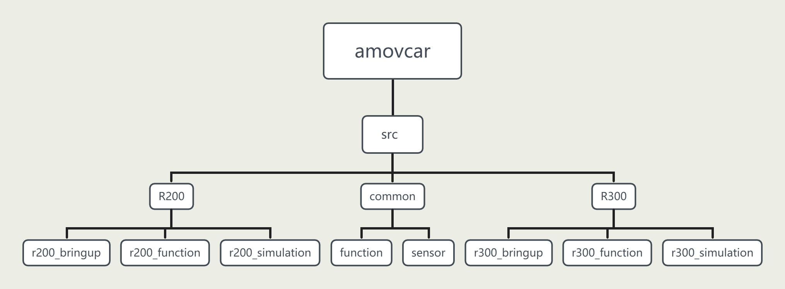

快速上手指引
===================

.. _通信链路: ../overview/通信链路.html

.. note::
    - 以下内容在用户拿到R300的时候已经完成配置和测试，保证功能正常。 **如果非必要，请勿修改！**
    - 以下内容可以作为您二次开发的一个例子

板载计算机设置
------------------

设置固定IP
^^^^^^^^^^^^^

1. 将无线/有线键鼠插入R300侧边的USB扩展口，然后打开R300电源
2. 输入密码 **amov** 登录到系统
3. 打开桌面右上角 **WIFI图标**，点击 **Wired Connected**，找到 **Wired Settings**，点击菜单栏上的 **IPV4** ,选择 **Manual** ，输入IP **192.168.1.14** ，子网掩码 **255.255.255.0** 如下图所示：
   
   .. image:: ../pics/Linux_IP.gif
      :alt: Linux_IP

设置相机序列号
^^^^^^^^^^^^^^^^^
1. 在桌面打开终端
2. 输入命令 ``rs-sensor-control`` ，该命令将会返回 D435i 和 T265的序列号
3. 接着打开目录： ``amovcar/src/common/sensor/amovcar_sensor/launch`` ，将会看到以对应传感器命名的launch文件
4. 分别打开D435i / T265 的launch文件，把文件中的参数 ``defalut`` 的值替换成第2步获取到的相机序列号即可。 
   

Homer配置
---------------------

1. 将基站端Homer用3S电池供电，再将专有网口线的一端接入基站端Homer的LAN1或LAN2口，另一端接入到PC的网口。（如果您的PC没有网口，则需要一个USB转网口模块）

   .. warning::
       - Homer需要用专门的电源线（电源线贴有 **电源线 12V** 字样的标签,如下图所示：
       - 
         .. image:: ../pics/tune.png
            :alt: tune

       - Homer的供电电压为12V

   .. note::
       - LAN1或LAN2口为百兆网口。百兆网线如下：
       - 
         .. image:: ../pics/100.png
            :alt: 100
      

2. 在PC上(Windows系统)打开 **控制面板---查看网络状态和任务---更改适配器设置---右键以太网---属性---Internet协议版本4---属性**，设置为如下图所示：

   .. image:: ../pics/IP.png
      :alt: ip

3. 将移动端Homer和基站端Homer同时通电。基站端Homer用3S电池供电，移动端Homer用小车电源供电。(或者也可以将移动端Homer拆下来，再单独用3S电池供电)
   
4. 基站端Homer配置
   
   - 首先将基站端Homer的工作模式，拨到 **AP端口**，如下图所示：
   - 
      .. image:: ../pics/AP.png
         :alt: AP

   - 打开浏览器，输入网址 **192.168.1.100** 进入配置界面
   - 用户名和密码均为 **admin**
   - 找到 **config** --- **Networking**，选择界面中的 **Static IP** 修改为如下图所示：
   - 
     .. image:: ../pics/AP_NET.png
        :alt: AP

   - 找到 **config** --- **Wireless**，找到界面中的 **ESSID**，修改为 **AMOV-002**；找到界面中的 **Passphrase**，将密码修改为 **12345678**。图下图所示：
   - 
     .. image:: ../pics/AP_WIFI.png
        :alt: AP_WIFI

   - 保存
  
5. 移动端Homer配置
   
   - 首先将移动端Homer的工作模式，拨到 **STA端口**，如下图所示：
   - 
     .. image:: ../pics/STA.png
        :alt: STA

   - 打开浏览器，输入网址 **192.168.1.10** 进入配置界面
   - 用户名和密码均为 **admin**
   - 找到 **config** --- **Networking**，选择界面中的 **Static IP** 修改为如下图所示：
   - 
     .. image:: ../pics/STA_NET.png
        :alt: STA_NET

   - 到 **config** --- **Wireless**，找到界面中的 **ESSID** 旁边的 **Scan AP**，此时将会搜索到基站端Homer配置的WIFI名称 AMOV-002，然后输入密码 12345678 点击连接，如下图所示：
   -
     .. image:: ../pics/STA_WIFI.png
        :alt: STA_WIFI

   - 保存

   .. note::
       - 确保在配置过程中，两个Homer都通电。
       - 当两个Homer正面的绿色指示灯常亮，表示二者正确配置并且互相连接成功。
       - 基站端(AP模式下)的WIFI名称和密码可以根据实际情况自定义
       - 移动端(STA模式下)，在连接上基站端的WIFI以后，一定要 **点击保存**，否则下一次启动将不会自动连接
     
6. 打开Homer配置软件（ `点击下载 <https://www.aliyundrive.com/s/kcCrEAiSddh>`_ 配置软件）
   
   - 根据实际情况选择网卡设备。然后刷新设备，可以看到当前网络设备。
   - 选择102，按照下图设置
   - 
     .. image:: ../pics/102.png
        :alt: 102
      
   - 选择12，按照下图设置
   - 
     .. image:: ../pics/12.png
        :alt: 12

   - 选择11，按照下图设置
   -      
     .. image:: ../pics/11.png
        :alt: 11
   
   .. note::
       - 101、102、103为基站端Homer的三个串口的IP地址，这个地址可以根据实际情况自定义
       - 11、12、13为移动端Homer的三个串口的IP地址，这个地址可以根据实际情况自定义
       - 在上面的配置中，使用移动端Homer的UART1串口(192.168.1.11)与飞控通信。见 通信链路_
       - 在上面的配置中，使用移动端Homer的UART2(192.168.1.12) / UART3(192.168.1.13) 串口与移动版RTK通信。见 通信链路_ 

.. warning::
   在配置RTK时，所有的 **RTK天线禁止热插拔**，即 **必须先断电，后插拔RTK天线**。

移动端RTK配置
----------------------

采用默认驱动，无需配置

基站端RTK配置
--------------------

1. 将基站端RTK用USB数据线连接至PC
2. 通电（对于移动端RTK，可以使用R300电源供电，也可以拆下后单独用3S电源供电）
   
   .. warning::
       - RTK供电线和Homer供电线不兼容，不能混用。必须使用专门的电源线。如下所示：
       - 
         .. image:: ../pics/RTK_cable.jpg
            :alt: RTK_cable
         
       - RTK的供电电压为12V

3. 在PC上打开浏览器，输入 **192.168.42.129** 进入配置界面
4. 输入用户名 **admin**， 密码 **password** 登录到配置界面
5. 在页面左边找到 **系统配置---网页命令** 在对话框中输入命令 ``posave auto``，点击提交
6. 然后输入 ``saveconfig``，点击提交
7. 在页面左边找到 **I / O配置---端口摘要** ，点击 COM2，即可进入COM2的配置界面
8. 在 **输出** 栏下面找到 **RTCM**，将其改为 **启用** ，点击确定即可

移动端RTK（4G）配置
--------------------------

1. 将移动端RTK天线接入到移动端RTK的ANT1口，将小天线(又称小辣椒)接入到移动端RTK的4G接口，并插入4G卡。
2. 通电（对于移动端RTK，可以使用R300电源供电，也可以拆下后单独用3S电源供电）
   
   .. warning::
       - RTK供电线和Homer供电线不兼容，不能混用。必须使用专门的电源线。如下所示：
       - 
         .. image:: ../pics/RTK_cable.jpg
            :alt: RTK_cable

       - RTK的供电电压为12V

3. 用USB数据线，一端接在移动端RTK的USB口，一端接在PC上
4. 在PC上打开浏览器，输入 **192.168.42.129** 进入配置界面
5. 输入用户名 **admin**， 密码 **password** 登录到配置界面
6. 在该页面，您可以看到当前RTK的工作状态，包括卫星观测值质量、跟踪卫星数量、以及定位方式等
7. 在页面左边的菜单栏找到 I/O配置，点击COM4口，进入如下图所示的配置
   
   .. image:: ../pics/4G.png
      :alt: 4G_RTK

.. note:: 
   - R300产品不提供千寻、六分账号，如果您有这方面的需求，点击 `阿木实验室淘宝店铺 <https://item.taobao.com/item.htm?ft=t&id=655767742934>`_ ，获取更多信息
  

R300软件框架
----------------------

amovcar文件结构图如下：

amovcar
^^^^^^^^^^^

amovcar文件夹为ROS下的工作空间文件夹，包含无人车几乎所有的源代码文件，无人车功能包均放置在src文件夹下。

common
^^^^^^^^^^^

common文件夹内含有R200以及R300两款无人车通用的一些功能包，包含一些功能模块以及二维激光雷达、三维激光雷达、相机等传感器驱动ROS功能包。

R200
^^^^^^^^^^^

R200文件夹内含有 ``r200_bringup``、 ``r200_function``、 ``r200_simulation`` 三个功能包。

r200_bringup为R200小车底盘的驱动功能包，R200下位机控制板为飞控，通过mavros连接飞控与板载计算机，r200_bringup在mavros上做了一层封装。
    
r200_function文件内含有R200无人车所有功能的源代码，包含自启动服务、配置文件、launch文件、sh脚本文件以及源代码等内容。

r200_simulation文件内含有R200无人车仿真的源代码，包含模型、gazebo环境、launch文件、配置文件等内容。

R300
^^^^^^^^^^^

R300文件夹内含有 ``r300_bringup``、 ``r300_function``、 ``r300_simulation`` 三个功能包。

r300_bringup为R300小车底盘的驱动功能包。
    
r300_function文件内含有R300无人车所有功能的源代码，包含自启动服务、配置文件、launch文件、sh脚本文件以及源代码等内容。

r300_simulation文件内含有R300无人车仿真的源代码，包含模型、gazebo环境、launch文件、配置文件等内容。

