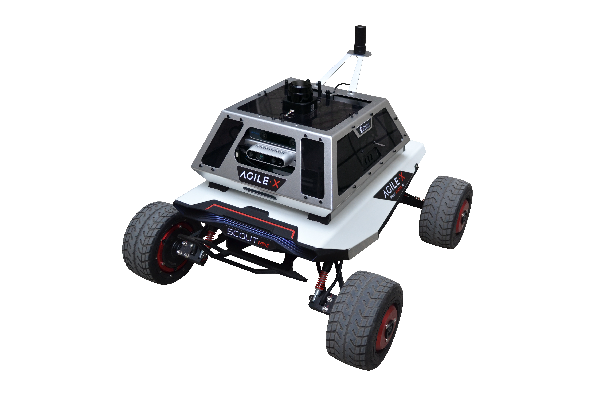

AutoPilot系列无人车特点
==========================================

AutoPilot无人车特点
----------------------

    
AutoPilot无人车车体属于中大型，越野性能优秀，偏向于室外环境。具备以下优点：

#. 前端配备有保险杠，有一定的防碰撞能力，能较好地保护车身及其他硬件，减少小车碰撞时的损坏。

#. 车身大部分硬件采用金属材质，结实耐用。

#. 车轮采用四轮驱动，动力更加充足，最高速度可达10km/h,并且可以原地旋转。

#. 小车拥有悬挂系统，能保证小车更加平稳地运行，保证各种传感器数据更加精确，稳定。

#. 24V15AH锂电池动力系统，续航里程可达10KM

#. 可载重10KG以下物体

